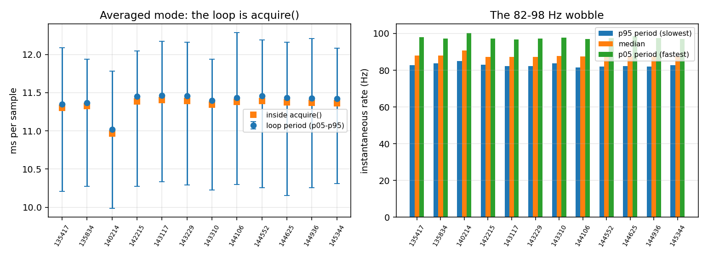
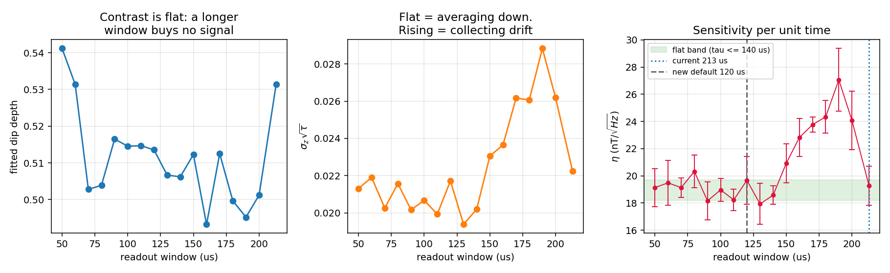
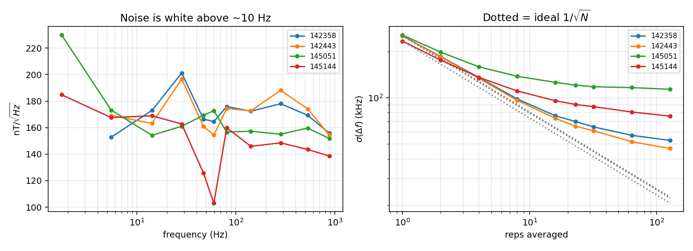
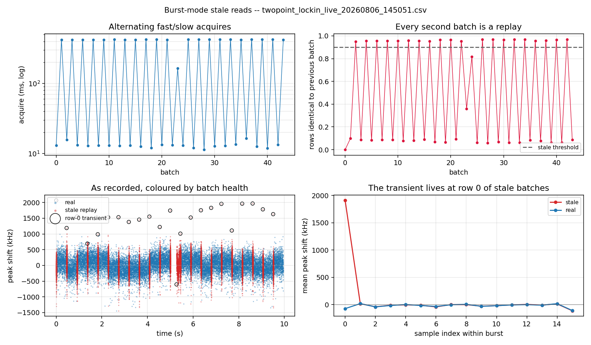

# Two-point lock-in: timing budget, sensitivity, and the burst-mode defect

**Session analysed:** `data/twopoint_lockin/08062026/` (2026-08-06)
**Written:** 2026-08-12
**Regenerate every number and figure here:** `python scripts/analyze_twopoint_session.py`
**Fill in the live per-RPC numbers (rig only):** `python scripts/profile_twopoint_acquire.py`

Every measured value in this document comes out of those two scripts. Tables live in
[`tables/`](tables/), figures in [`figures/`](figures/). Nothing is typed by hand, so
re-running the analysis after a new session refreshes the document rather than
invalidating it.

---

> **Superseded 2026-08-17.** Merged into [`../twopoint_master_reference/TWOPOINT_MASTER_REFERENCE.pdf`](../twopoint_master_reference/TWOPOINT_MASTER_REFERENCE.pdf), whose Chapter 11 is a
> register of every correction to this file. Kept as the record of what was believed
> on 2026-08-12.

---

> ## ⚠ Correction — 2026-08-16
>
> **Claim 1 below is wrong and is retracted.** The rate is **host-bound**, not FPGA-bound.
> The original comment in Step 4 of the notebook — the one this document "corrected" — was
> closer to the truth than the correction was.
>
> The error was methodological: the 2026-08-06 session ran at a **single operating point**
> (τ = 213 µs, 23 reps), where the FPGA work (9.80 ms) happens to be almost exactly the
> batch period (11.38 ms). Attributing the difference to host overhead assumed a serial
> `period = host + FPGA` model that one point cannot test.
>
> The 2026-08-14 session tests it. τ was correctly reduced to 120 µs, FPGA work per batch
> fell from 9.80 ms to **2.40 ms**, and the batch period **did not move** (11.34 ms). Worse
> for the serial model: the *fastest* batch in those runs is 10.14 ms, above the supposed
> host term. Across 08-04/06/14, FPGA work spans **2.40 → 9.80 ms while the period stays
> 10.2 → 11.4 ms**.
>
> There is a **~10 ms floor per `acquire()` call** that is independent of the readout
> window. FPGA work is effectively free underneath it. Consequences that reverse what §2
> and §2.6 say:
>
> - Shortening τ cannot raise the averaged-mode rate. It never could.
> - **Averaging is free up to the floor**: at τ = 120 µs, `reps` can rise to ~40 at no cost
>   in rate.
> - Beating ~90 Hz requires amortising the floor across many samples — burst or stream.
>
> §3 (the readout-window optimum) and §4 (the burst-mode replay) are unaffected: neither
> depends on the timing model. But note that §4.3's root cause is **disproved** — see the
> second correction at §4.3.
>
> Full evidence and the corrected model:
> [`../2026-08-14_twopoint_methods/TWOPOINT_METHODS_AND_TIMING.md`](../2026-08-14_twopoint_methods/TWOPOINT_METHODS_AND_TIMING.md) §3.3.

---

## 1. Executive summary

Three separate problems, one of which had been mis-diagnosed in the notebook itself.

**1. ~~The rate is FPGA-bound, not host-bound.~~ RETRACTED — see the correction above.** At
23 reps a batch takes 11.37 ms, of which 9.77 ms is the two ADC integration windows and
~1.6 ms was attributed to host round-trip. The 2026-08-14 data shows that attribution is
wrong: the two terms run concurrently, and there is a ~10 ms per-call floor that sets the
rate at any readout window. The Python loop outside `acquire()` costing 0.047 ms (0.4% of
the period) still stands. See §2, read with the correction above.

**2. 213 µs is past the sensitivity optimum.** Across a 17-point integration-time sweep,
dip contrast is flat (0.49–0.54) and `σ_z·√τ` is constant below ~140 µs but rises above it —
i.e. beyond ~140 µs the readout stops averaging down and starts collecting drift. Per-rep
sensitivity η is **185 ± 7 nT/√Hz for τ ≤ 140 µs** against **232 ± 20 nT/√Hz for
150–200 µs**. Moving 213 → 120 µs is **1.75× faster with no sensitivity cost** (the η
difference, 188 vs 192, is inside the ±14 nT/√Hz sweep-to-sweep scatter). See §3.

**3. Burst mode records ~50% stale duplicate samples.** Acquires strictly alternate
~13 ms / ~425 ms, and **95.7% of the rows in each fast batch are bit-identical to the
previous slow batch** — half of every burst run is a replay of the one before it. The large
periodic spike in `Burst Mode.png` is row 0 of each stale batch reading **+1908 kHz
(+68 µT)**; the smaller "less periodic" spikes are real single-rep glitches that appear
twice because the replay reproduces them; the visible break at t ≈ 5 s is the periodic
CSV rewrite. The recorded 4.4 kHz is really **2.1 kHz**. See §4.

A specific, verifiable software defect underlies (3): `qickdawg` calls `config_all` with a
keyword the installed `qick` does not accept, so **every acquire raises `TypeError`,
silently falls back, and never stops the tProc**. See §4.3.

---

## 2. Where every microsecond goes

This is the section to read if the question is "why is it 87 Hz and why does it wobble".

Operating point on 2026-08-06: `readout_integration_tus = 213`, `relax_delay_treg = 1000`,
two parked frequencies, `multipoint_skip_reference = True` (one readout per frequency),
`LIVE_REPS_PER_BATCH = 23`, `pre_init = False`, headless (no live plot).

### 2.1 Anatomy of one rep

`MultipointLockinODMR.body()` ([`notebook_modules/multipoint_lockin_program.py:100-156`](../../notebook_modules/multipoint_lockin_program.py))
emits, **per parked frequency**:

| # | ASM step | Cost |
|---|---|---|
| 1 | `mw_frequency_register.set_to(f)` | a few tProc cycles (~ns) |
| 2 | `pulse(ch=mw_channel, t=0)` — MW const pulse, length = readout window | overlaps the readout, adds nothing |
| 3 | `trigger_no_off(adcs, pins=[laser_gate], width=readout_integration_treg, t=0)` | **213 µs — the ADC integration window** |
| 4 | `trigger(pins=[laser_gate], width=relax_delay_treg, t=readout_integration_treg)` | 2.33 µs nominal, closes the laser gate |
| 5 | `wait_all()` | ~0 |
| 6 | `sync_all(relax_delay_treg)` | 2.33 µs nominal |

With two frequencies and the reference readout skipped, that is **two 213 µs ADC windows per
rep** plus four nominal 2.33 µs relax windows.

**The model in the code over-predicts.** `time_per_rep()` sums steps 3–6 as
`n_freqs × (readout + 2 × relax)` = `2 × (213 + 4.66)` = **435.3 µs**. The measured cadence,
taken from four burst runs as `acq_seconds / n_samples` over the batches that really ran, is
**424.8 µs** (423.8 / 424.5 / 425.1 / 425.4 µs — see [`tables/staleness.csv`](tables/staleness.csv)).
That is `2 × 212.4 µs`, i.e. **the rep is the two ADC windows and essentially nothing else**;
the relax and sync windows are absorbed rather than serialised. The practical model is:

```
time_per_rep  ≈  n_freqs × n_readouts_per_freq × readout_integration_tus
batch_time    ≈  reps × time_per_rep  +  host_overhead
```

`profile_twopoint_acquire.py` prints the resolved `readout_integration_tus` / `relax_delay_tus`
against both models so the residual 2.5% is attributable rather than assumed.
`time_per_rep()` is corrected in §6.

### 2.2 The per-acquire host chain

`NVAveragerProgram.acquire` ([`qickdawg/nvpulsing/nvaverageprogram.py:163-283`](../../qickdawg/nvpulsing/nvaverageprogram.py))
issues this sequence of Pyro RPCs to the board on **every** call:

| Stage | Call | Notes |
|---|---|---|
| 1 | `config_all(soc, load_pulses=…, load_mem=False)` | **raises `TypeError` every time** (§4.3) |
| 2 | `config_all(soc)` (fallback) | `load_envelopes=True`, `reset=False`, `load_mem=True` |
| 2a | → `soc.start_src("internal")` | inside `config_all` |
| 2b | → `soc.stop_tproc(lazy=True)` | **no-op on tProc v1** |
| 2c | → `load_envelopes`, `load_bin_program`, `load_mem` | re-uploaded each call |
| 3 | `soc.start_src(start_src)` | again, from `acquire` |
| 4 | `config_bufs(soc, enable_avg=True, enable_buf=False)` | arms the accumulated buffer |
| 5 | `soc.reload_mem()` | **no-op unless tProc v2** |
| 6 | `soc.start_readout(total_count, …)` | starts the streamer worker + tProc |
| 7 | `soc.poll_data()` × N | blocks here while the FPGA runs |
| 8 | Pyro deserialise + `analyze_results` reshape | host-side |

Stage 7 is where the FPGA time is spent, so "host overhead" is stages 1–6 plus 8. From the
saved CSVs that residual is **11.37 − 9.77 = 1.60 ms (14%)**. The per-RPC split inside it
needs the rig: run `profile_twopoint_acquire.py`, which wraps the soc proxy and times every
remote call individually, and paste its `measured_rpc_breakdown.csv` here.

> **Status:** awaiting a rig run. Everything else in this document is measured.

### 2.3 Per-batch Python cost

Measured directly as `period − acq_seconds`, across 12 averaged runs
([`tables/timing.csv`](tables/timing.csv)):

| Quantity | Value |
|---|---|
| median | **0.047 ms** (0.4% of the period) |
| p95 | 0.12 ms |
| max | 33 ms |

So the row-dict construction, `hist` extension and conversion arithmetic are **not** a
bottleneck at 87 Hz, and the earlier vectorisation of the per-sample conversion did its job.
The `max` is the exception and it is not random: see §2.5.

### 2.4 The measured budget

At τ = 213 µs, 23 reps, two frequencies, no reference readout:

| Component | Time (ms) | Share |
|---|---:|---:|
| ADC integration windows — 2 freqs × 213 µs × 23 reps | 9.77 | 85.9% |
| relax / sync windows (absorbed, see §2.1) | ~0 | ~0% |
| **FPGA subtotal (measured cadence 424.8 µs × 23)** | **9.77** | **85.9%** |
| Host round-trip inside `acquire()` (stages 1–6, 8) | 1.60 | 14.1% |
| **`acquire()` total (median)** | **11.37** | **100%** |
| Python outside `acquire()` | 0.047 | 0.4% |
| **Loop period (median)** | **11.43** | → **87.5 Hz** |

(The three medians are computed independently over all batches, so they do not sum exactly.)

> **Correction 2026-08-16.** The "host round-trip = 1.60 ms" row is a *residual*, not a
> measurement: it is `period − FPGA` under an assumed serial model. The 2026-08-14 data
> (FPGA 2.40 ms, period 11.34 ms, fastest batch 10.14 ms) shows the two terms overlap and
> that the host chain is really **~10 ms**. Read this table as "9.77 ms of FPGA work fits
> inside a ~10 ms host call", not as a serial sum.

### 2.5 Why the rate wobbles 82–98 Hz

Across 12 averaged runs, the instantaneous rate spans **81.4 → 100.1 Hz** with a median of
87.5 Hz — matching the 85–97 Hz seen live. The decomposition:

- **The FPGA term is deterministic.** 23 reps of identical pulse work vary by well under a
  microsecond, and the burst runs confirm the cadence is stable to 0.4% across runs.
- **All of the wobble is inside `acquire()`.** The period p05→p95 spread is 10.16 → 12.21 ms
  while `acq_seconds` spans 10.1 → 12.1 ms and the Python gap stays at 0.047 ms. The host
  round-trip itself is swinging between roughly **0.3 ms and 2.4 ms** — Windows scheduling
  plus TCP/Pyro latency on stages 1–6.
- **The rare 25–220 ms stalls are the CSV flush.** `SAVE_EVERY_SEC = 5.0` rewrites the
  *entire* DataFrame every 5 s, so the cost grows with the run (O(N²) overall). Of the 94
  outlier batches across the session, **46 sit within 150 ms of a 5-second boundary**, and
  the worst stall measured is **220 ms**. In burst mode this is exactly the visible break at
  t ≈ 5 s in `Burst Mode.png`.



### 2.6 What each knob actually buys

> **Correction 2026-08-16.** The model in this section, `period ≈ reps × n_freqs × τ +
> 1.6 ms`, is wrong. The correct one is
> `period ≈ max(10 ms, reps × n_freqs × τ)`. The τ and reps rows below are therefore
> **backwards**: neither is a rate lever until the FPGA work exceeds ~10 ms, and reps is a
> *free sensitivity* lever below that. Corrected table:
> [`../2026-08-14_twopoint_methods/TWOPOINT_METHODS_AND_TIMING.md`](../2026-08-14_twopoint_methods/TWOPOINT_METHODS_AND_TIMING.md) §3.5.
> The `skip_reference`, `n_freqs`, `LIVE_SHOW_PLOT` and `SAVE_EVERY_SEC` rows still hold.

Using the (superseded) model `period ≈ reps × n_freqs × τ + 1.6 ms`:

| Knob | Effect on rate | Effect on sensitivity | Verdict |
|---|---|---|---|
| `readout_integration_tus` (τ) | ~~**linear** — the dominant term~~ **none below the floor** | flat for τ ≤ 140 µs, worse above | ~~the main lever~~ **not a rate lever** |
| `LIVE_REPS_PER_BATCH` | ~~linear~~ **none below the floor** | √N only while noise is white; ×23 currently delivers ×2.9, not ×4.8 | **free averaging** up to the floor |
| `multipoint_skip_reference` | 2× (already enabled) | removes a contaminated normaliser | keep on |
| `n_freqs` | linear | two is the minimum for a two-point estimator | fixed at 2 |
| host overhead | ~~fixed ~1.6 ms~~ **~10 ms floor** per **call** | none | only avoidable by not calling per sample — §4.4 |
| `LIVE_SHOW_PLOT` | 20–100 ms per redraw | none | keep `False`, already is |
| `SAVE_EVERY_SEC` rewrite | 25–220 ms every 5 s | none | fix to append-only — §6 |

**The 1 kHz question.** The conclusion here survives the correction, and in fact gets
stronger: the per-call cost is ~10 ms, not 1.6 ms, so a 1 ms period is unreachable by a wide
margin with one call per sample. It needs a single `start_readout` with continuous polling
(§4.4). That was built, and on 2026-08-14 it delivered **1041.7 Hz** as designed — though at
a noise floor ~6× worse than burst mode, which is a separate open defect.

---

## 3. Normal-mode sensitivity

### 3.1 The readout window is past its optimum

From 92 ODMR sweeps at 17 readout windows
([`tables/integration_time.csv`](tables/integration_time.csv)). Fits are Lorentzian over
2840–2900 MHz; noise is the point-to-point scatter of the off-resonance wings, which is
immune to slow drift across the sweep. The figure of merit is the per-rep sensitivity
η = σ(Δf)·√t_rep — it already contains the time cost, so it is directly comparable across τ.

| τ (µs) | contrast | σ_z | σ_z·√τ | σ(Δf) kHz | t_rep µs | **η nT/√Hz** | Hz @23 reps |
|---:|---:|---:|---:|---:|---:|---:|---:|
| 50 | 0.541 | 3.01e-3 | 0.0213 | 51.3 | 109 | 186 ± 14 | 398 |
| 90 | 0.517 | 2.13e-3 | 0.0202 | 37.0 | 189 | **177 ± 14** | 230 |
| 110 | 0.515 | 1.90e-3 | 0.0199 | 33.7 | 229 | **178 ± 8** | 190 |
| **120** | 0.514 | 1.98e-3 | 0.0217 | 34.9 | 249 | 192 ± 17 | 174 |
| 130 | 0.507 | 1.70e-3 | 0.0194 | 30.6 | 269 | **175 ± 15** | 161 |
| 140 | 0.506 | 1.71e-3 | 0.0202 | 30.6 | 289 | 181 ± 7 | 150 |
| 170 | 0.513 | 2.01e-3 | 0.0262 | 35.6 | 349 | 232 ± 5 | 124 |
| 190 | 0.495 | 2.09e-3 | 0.0288 | 38.4 | 389 | 264 ± 22 | 112 |
| **213** | 0.531 | 1.52e-3 | 0.0222 | 25.9 | 435 | 188 ± 14 | **100** |

**How η is computed, and a correction.** Sensitivity has to carry *both* time
dependencies: σ_z falls with τ because a longer window integrates more photons, and a
sample costs time proportional to τ. The trap is which time pairs with which σ. Each
sweep point is an **average over `reps` reps**, so its σ corresponds to `reps × t_rep` of
integration, not one rep. The first version of this table paired a reps-averaged σ with a
single-rep time and so understated η by √reps — a factor of ~10.

`reps` is not recorded in the sweep CSVs, and it cannot be recovered from file timestamps
(those gaps are dominated by how fast the operator clicked: the median gap is 4 s while
t_point varies 4×). It is instead cross-calibrated against the burst runs, which measure a
genuine single-rep σ at τ = 213 µs — one of the scanned windows:

| Quantity at τ = 213 µs | Value |
|---|---:|
| single-rep σ(Δf), from 7 burst runs | 252.2 kHz |
| sweep-point σ(Δf) | 25.9 kHz |
| ratio | 9.74 |
| → reps averaged per sweep point | **~95** |

The corrected figures are now consistent with an **independent** measurement: the white
noise floor from the burst PSD is ~165 nT/√Hz (§3.2), against 185 nT/√Hz per rep here. The
old 19 nT/√Hz was inconsistent with that PSD by 10×, which is what gave the error away.

Three things follow:

1. **Contrast is flat.** 0.49–0.54 across the whole range — a longer window buys no signal.
2. **`σ_z·√τ` is flat below ~140 µs (0.0207) and rises above it (0.0252).** Below 140 µs the
   readout averages down as √time; above it, the extra window length is collecting drift
   instead of statistics. That is the physical reason the optimum exists.
3. **η is flat at 185 ± 7 nT/√Hz for τ ≤ 140 µs**, then degrades to 232 ± 20 over
   150–200 µs. Individual windows inside the flat band (90, 110, 130 µs) are not
   meaningfully better than one another — the sweep-to-sweep scatter at fixed τ is
   ±14 nT/√Hz, larger than the spread between them.

**Caveat on the 213 µs point.** It sits at 188 nT/√Hz, well below the 150–200 µs trend it
should continue, on the strength of an unusually low σ_z (1.52e-3). It is the configured
default, so those sweeps were likely taken under different conditions from the rest of the
scan. Treat it as an outlier rather than evidence that 213 µs is fine; the `σ_z·√τ` trend
across 150–200 µs is the more reliable signal.

**Caveat on the shape.** The scale correction above is a single constant, so it cannot
change the *shape* of the curve. But the shape itself assumes `reps` was held constant
across the τ scan. That is the natural reading of a controlled one-variable scan, and it is
what `σ_z·√τ` being flat below 140 µs implies — but it is an assumption, not a measurement,
and a reps change part-way through the scan could mimic the rise above 140 µs. The rig check
at τ = 120 µs (§7, check 5) tests the conclusion directly and does not depend on it. The
**rate** gain of 1.75× is pure timing and is certain either way.

**Decision: τ = 120 µs.** It is inside the flat band, 1.75× faster than 213 µs, and its η
difference from 213 µs is inside the measurement scatter.



### 3.2 Averaging 23 reps does not buy √23

Block-averaging the real burst samples within each burst
([`tables/noise_block_average.csv`](tables/noise_block_average.csv)):

| reps averaged | σ(Δf) kHz | ideal 1/√N | excess |
|---:|---:|---:|---:|
| 1 | 248.6 | 248.6 | 1.00 |
| 4 | 141.0 | 124.3 | 1.13 |
| 8 | 110.8 | 87.9 | 1.26 |
| **23** | **86.7** | **51.8** | **1.67** |
| 64 | 76.5 | 31.1 | 2.46 |
| 128 | 72.3 | 22.0 | 3.29 |

The predicted 86.7 kHz at N=23 matches the averaged runs, which come in at **73–110 kHz for
11 of the 12 runs (median 94 kHz)** — a good independent consistency check on the whole
chain, since the two are measured in completely different modes. (The twelfth, `_135417`,
sits at 252 kHz; it is the first run of the day and is treated as an outlier throughout.)
But 86.7 kHz is 1.67× worse than white noise would give, and the excess grows with N: past
~30 reps, averaging is nearly free of benefit.

The spectrum says why — the noise is **white above ~10 Hz at ~165 nT/√Hz** (no 60 Hz line,
no discrete tones) with excess power only below 10 Hz
([`tables/noise_psd.csv`](tables/noise_psd.csv)). A 23-rep batch spans 9.8 ms, so batches are
correlated through that sub-10 Hz drift.

**Consequence: bandwidth is cheaper than the naive √N argument suggests.** Going from 87 Hz
to 1 kHz costs far less in per-sample noise than 1/√11.5, because the averaging being given
up was only delivering 1/1.67 of its nominal value.



### 3.3 Common-mode rejection works, and points at the next improvement

In the heat-gun / motor run (`_144625`), z at f− and f+ swing **13.4% peak-to-peak
together** while the lock-in difference stays flat — a rejection ratio of **32×**
([`tables/common_mode.csv`](tables/common_mode.csv)). The two-point difference is doing its
job against slow common-mode PL excursions.

The limitation is *when* the two points are sampled. f− and f+ are read sequentially,
**212 µs apart, always in the same order**. Any common-mode drift therefore enters the
difference to first order in that 212 µs interval — the difference is effectively a
discrete-time derivative of the common mode. Emitting the pair as **f−, f+, f+, f−** (ABBA)
instead of f−, f+ cancels the linear term at no extra time cost, and is the main sensitivity
lever left after τ. Implemented in §6; A/B measurement pending on the rig.

*(Short-lag autocorrelation was checked as a possible signature of this: over 12 averaged
runs the lag-1 value is −0.06 on average but ranges from −0.26 to +0.26, so it is not
consistent enough to draw a conclusion from. The ABBA A/B test is the cleaner experiment.)*

---

## 4. Burst mode

### 4.1 The evidence

Four burst runs, `LIVE_BURST_REPS` = 500 or 1000
([`tables/staleness.csv`](tables/staleness.csv)):

| run | batches | stale | cadence µs | duty | recorded Hz | **true Hz** | row-0 shift, stale | row-0 shift, real |
|---|---:|---:|---:|---:|---:|---:|---:|---:|
| `_142358` | 211 | 106 (50%) | 424.5 | 0.83 | 3911 | **1946** | +2285 kHz | −14 kHz |
| `_142443` | 66 | 33 (50%) | 423.8 | 0.89 | 4182 | **2091** | +2376 kHz | −68 kHz |
| `_145051` | 44 | 23 (52%) | 425.4 | 0.90 | 4421 | **2110** | +1427 kHz | −76 kHz |
| `_145144` | 14 | 7 (50%) | 425.1 | 0.95 | 4455 | **2227** | +1545 kHz | −132 kHz |

- Acquires **strictly alternate** ~13 ms / ~425 ms.
- Duplicate fraction is **0.957 in the fast batches** and 0.069 in the real ones — a clean
  separation with nothing in between.
- Within a stale batch the only rows that differ from the previous batch are **row 0** and a
  block around rows 770–818 (819 = the streamer's transfer stride,
  `0.1 × avg_maxlen / reads_per_shot`).
- **The recorded rate is double the real one.** 4.4 kHz recorded, 2.1 kHz of actual samples.



The bottom-left panel is the whole story in one picture: the stale replays (red) are
compressed into narrow vertical stripes because their 1000 samples are stamped across a
13 ms window, while the real samples (blue) spread across 425 ms. The circled points are the
row-0 transients — one every ~0.45 s, which is precisely the periodicity in `Burst Mode.png`.

### 4.2 Mapping the artefacts onto what was seen

| Artefact in `Burst Mode.png` | Cause |
|---|---|
| Large, strictly periodic spike (~0.45 s) | Row 0 of each stale batch: **+1908 kHz ≈ +68 µT** mean. Real batches show −72 kHz at row 0, so this is not a physical post-idle transient — it is the buffer read. |
| Smaller, "not as periodic" spikes | **Genuine single-rep glitches, recorded twice.** e.g. −1443 kHz at sample 824 appears in both batch 11 and its replay batch 12. Real, but double-counted. |
| Big break after a burst (~t = 5 s) | The `SAVE_EVERY_SEC = 5.0` full-DataFrame rewrite — a 267 ms gap in `_145051` (§2.5). |
| Dense/sparse striping across the trace | The **timestamp model**. `t = t_start + (k+0.5)/n × acq_dt` spreads a batch across its *measured* window: 13 ms for a stale batch, 425 ms for a real one — a 33× time-axis compression alternating batch to batch, even though the true cadence is a constant 424.8 µs. |

### 4.3 Root cause

`qickdawg/nvpulsing/nvaverageprogram.py:215` calls:

```python
self.config_all(qd.soc, load_pulses=load_pulses, load_mem=False)
```

The installed `qick` (0.2.386) defines:

```python
AbsQickProgram.config_all(self, soc, load_envelopes=True, reset=False, load_mem=True)
```

There is no `load_pulses` parameter. **Every acquire raises `TypeError`**, is caught by the
`except TypeError` block two lines down, and falls back to `config_all(qd.soc)` — taking
the defaults, including `reset=False`. And `reset=False` means:

```python
soc.stop_tproc(lazy=not reset)   # lazy=True
```

which `qick` documents as *"do nothing for v1"*. **On tProc v1 the tProc is therefore never
stopped between acquisitions.** A new program is configured and started while the previous
430 ms run may still be executing and writing the accumulated buffer, so the buffer and the
shot counter are not in a known state when the next readout begins.

This is consistent with the symptom pattern: normal mode, where a run finishes in 9.8 ms
well before the host comes back around, shows **zero stale batches across all 20,365
averaged batches in the session**. The race only opens when the program is long.

`profile_twopoint_acquire.py --check-only` verifies this statically, on any machine:

```
qick version              : 0.2.386
config_all accepts ...    : load_pulses=False, load_envelopes=True, reset=True
qickdawg passes           : load_pulses=
MISMATCH. Every acquire() raises TypeError and falls back to
config_all(soc) with reset=False. ...
```

**Confidence.** The signature mismatch and the never-stopped tProc are certain. That they
are the *sole* cause of the stale reads is a strong hypothesis, not yet proven — it needs
the rig. The fixes in §6 are deliberately layered so the outcome does not depend on it:
the correction is applied first, a freshness guard catches any residual duplicates
regardless of mechanism, and the streaming mode avoids the race by construction.

> ### ⚠ Correction 2026-08-16 — the hypothesis is disproved
>
> The rig ran the corrected code on 2026-08-14 (confirmed: τ = 120 µs took effect and the
> new streaming cell produced output), with `reset_tproc=True` active in burst mode. The
> replay is **unchanged**: `twopoint_lockin_live_20260814_150458.csv` has **185 of 371
> batches ≥90% bit-identical to the batch before**, exactly 50.0%, with the same strictly
> alternating 12 ms / 120 ms signature.
>
> So fixing the `config_all` keyword and forcing `reset=True` is **not** the cure. The
> signature mismatch was a real bug and is still worth having fixed, but it was not the
> mechanism. The layering described above is what saved this: the freshness guard detects
> the replay regardless of cause, and streaming is unaffected (zero duplicate rows across
> 31,250 samples).
>
> Current mitigation is to make the guard *act* rather than warn
> (`multipoint_on_stale="drop"`), and to prefer streaming for sustained high rates.
> See [`../2026-08-14_twopoint_methods/TWOPOINT_METHODS_AND_TIMING.md`](../2026-08-14_twopoint_methods/TWOPOINT_METHODS_AND_TIMING.md) §6.

### 4.4 Why streaming is the real answer

Even with the race closed, the per-call architecture wastes the inter-burst gap and cannot
reach 1 kHz (§2.6). `qick`'s streamer already supports what is needed: one `start_readout`
followed by continuous `poll_data`, with the worker transferring in strides of
`0.1 × avg_maxlen / reads_per_shot` shots. One configuration, one program start, no
per-batch reconfiguration — therefore no stale-buffer race, no duty-cycle hole, and
timestamps that follow the FPGA cadence exactly.

The one constraint is the streamer's own guard: it raises if unread samples reach
`avg_maxlen`. At τ = 120 µs the cadence is ~4 kHz with one read per shot, so even a modest
buffer allows a poll interval of order a second — comfortable. The implementation reads
`avg_maxlen` at runtime rather than assuming it.

---

## 5. Post-processing fallback

Independently of the hardware fix, the 2026-08-06 burst data can be made usable.
`scripts/clean_burst_lockin.py` (see §6) removes, in order:

1. **Stale batches** — detected by two independent tests: ≥90% of rows identical to the
   previous batch, *or* a wall-clock duration under half the FPGA work the batch claims to
   contain. Both are needed: on `_145051` batch 24 is 82% duplicate (under the fraction
   threshold, because the run's one CSV-flush stall shifted the alignment) but returned in
   12.9 ms against 425 ms of claimed pulse work.
2. **The row-0 transient** of every batch.
3. **Wrong timestamps** — rebuilt on the measured cadence, with each surviving burst marked
   as its own segment so the inter-burst dead time is an explicit gap. Nothing is
   interpolated across it and PSDs are computed per segment.
4. **Residual impulsive spikes** — via the existing `HampelDespiker`.

**What it cannot do:** the samples lost to the dead time between bursts are simply not
there, and the genuine single-rep glitches that were double-counted are only *de*-duplicated,
not explained. It recovers a correct 2.1 kHz record from a 4.4 kHz one; it does not recover
the 4.4 kHz.

---

## 6. Changelog

Changes made against this analysis, one commit each.

### `qickdawg/nvpulsing/nvaverageprogram.py`

| Change | Effect |
|---|---|
| `config_all(..., load_pulses=)` → `load_envelopes=` | Stops the `TypeError` raised on every acquire (§4.3) |
| new `reset_tproc=` argument on `acquire()` | Lets a caller force the tProc stop that `reset=False` skips on tProc v1 |
| silent `except TypeError` now warns | A future signature drift will be visible instead of silently degrading |

`load_mem=True` was kept deliberately: the original `load_mem=False` never took effect, so
`True` is what has actually been running. `reset_tproc` defaults to `False`, so
`Lockin_module` and `ODMR_module` are unaffected.

### `notebook_modules/multipoint_lockin_program.py`

| Change | Effect |
|---|---|
| `time_per_rep()` no longer adds the relax windows | Predicts **87.7 Hz** at the old operating point against **87.5 Hz** measured (was 435.3 µs/rep against 424.8 measured) |
| `predicted_rate_hz()`, `describe_timing()` | A run prints its achievable rate before it starts |
| `multipoint_pair_order = "abba"` | Cancels linear common-mode drift between the parked points. Under a 0.5/slot drift, forward reports B−A = 10.5 against a truth of 10.0; abba reports 10.0. Free at equal averaging: 23 abba reps and 46 forward reps are both 79.1 Hz |
| freshness guard in `acquire()` | Flags a buffer identical to the previous call into `n_stale_acquires`; policy `warn`/`raise`/`ignore` |
| `stream()`, `stream_headroom()` | One configuration, one tProc start, continuous polling — the 1 kHz path (§4.4) |

### `Modules/Twopoint_Lockin_module.ipynb`

| Change | Effect |
|---|---|
| `readout_integration_tus` 213 → **120** | **~140 Hz** at 23 reps, up from ~87 Hz, at no sensitivity cost — η 188 vs 192 nT/√Hz, inside the ±14 scatter (§3.1) |
| Step 4 comment block rewritten | Removed the "~10 ms fixed host overhead, FPGA work is free" claim, which had the split backwards |
| 5-second save is now append-only | Byte-identical output, **10.2× cheaper** over 40k rows, flat per-flush cost instead of growing. Removes the 25–220 ms stalls and the 267 ms burst break |
| `LIVE_PAIR_ORDER`, `LIVE_RESET_TPROC` | Ordering and tProc-stop control; reset defaults on in burst mode, off in averaged mode |
| end-of-run freshness report | A run says outright whether any batch was a replay |
| **new Step 4b — streaming cell** | `STREAM_TARGET_HZ` averages whole reps on the host to hit a target rate (1 kHz = 4 reps at τ=120 µs). Auto-zero runs before the stream so the whole file shares one zero |

### New scripts

| Script | Purpose |
|---|---|
| `scripts/analyze_twopoint_session.py` | Regenerates every number and figure in this document |
| `scripts/profile_twopoint_acquire.py` | Rig-side per-RPC timing; `--check-only` verifies the `config_all` defect anywhere |
| `scripts/clean_burst_lockin.py` | Salvages burst runs already recorded (§5) |
| `notebook_modules/burst_qc.py` | Shared stale-batch, cadence and segment logic, so the analysis and the cleaner cannot disagree |

### Measured effect of the cleaner

On the three 2026-08-06 burst runs:

| | `_145051` | `_142443` | `_145144` |
|---|---:|---:|---:|
| stale batches removed | 23/44 (52%) | 33/66 (50%) | 7/14 (50%) |
| row-0 transients removed | 44 | 66 | 14 |
| samples above +1200 kHz | 17 → **0** | — | — |
| peak-to-peak (kHz) | 3509 → **2276** | 4518 → **2330** | 5012 → **3031** |
| recorded → real rate (Hz) | 4421 → **2108** | 4182 → **2087** | 4455 → **2225** |
| timestamp spacing | 11 µs–267 ms → **uniform 425.4 µs** | | |

Standard deviation barely moves (259 → 255 kHz on `_145051`) because the artefacts are
huge but rare. Peak-to-peak is the honest indicator, and the report prints both.

---

## 7. Verifying on the rig

Everything above is measured offline from saved CSVs, except the per-RPC split in §2.2.
These checks need the RFSoC, and each has a number that decides pass or fail.

| # | Check | Command | Pass criterion |
|---|---|---|---|
| 1 | `config_all` defect is gone | `python scripts/profile_twopoint_acquire.py --check-only` | Reports OK, not MISMATCH |
| 2 | Per-RPC budget | `python scripts/profile_twopoint_acquire.py` | FPGA ≈ 86% of the batch, host 0.3–2.4 ms. Paste `measured_rpc_breakdown.csv` into §2.2 |
| 3 | Rate model holds | same run, section 3 of its output | measured/predicted ≈ 1.0 at reps ≥ 100; confirms the corrected `time_per_rep()` |
| 4 | **Burst mode is fixed** | 10 s burst run, `LIVE_BURST_MODE = True` | `prog_live.n_stale_acquires == 0` (was ~50% of batches), and no row-0 transient |
| 5 | New readout window | 30 s run at τ = 120 µs, 23 reps | **≥ 135 Hz** median, σ(Δf) no worse than the current ~94 kHz. This also settles the constant-`reps` assumption in §3.1 |
| 6 | ABBA A/B | two 30 s runs, `LIVE_PAIR_ORDER` = `"forward"` then `"abba"` at 23 / 46 reps so the averaging matches | abba σ(Δf) ≤ forward σ(Δf); report both |
| 7 | **1 kHz streaming** | Step 4b, `STREAM_TARGET_HZ = 1000` | ≥ 1.0 kHz sustained, `time_s` monotonic with uniform spacing, duty cycle near 100% |

Check 4 is the one that decides whether §4.3 was the whole story. If stale batches persist
after the fix, the freshness guard will say so, and the streaming path (check 7) is the
route that avoids the race by construction rather than by repair.

---

## 8. Reproducing this

```bash
# All offline analysis: tables + figures (no hardware)
python scripts/analyze_twopoint_session.py

# Static verification of the config_all defect (no hardware)
python scripts/profile_twopoint_acquire.py --check-only

# Live per-RPC timing and rate model (rig only)
python scripts/profile_twopoint_acquire.py --ip 192.168.0.103

# Clean an already-recorded burst run
python scripts/clean_burst_lockin.py "data/twopoint_lockin/08062026/Drone Sweeps/twopoint_lockin_live_20260806_145051.csv"
```
