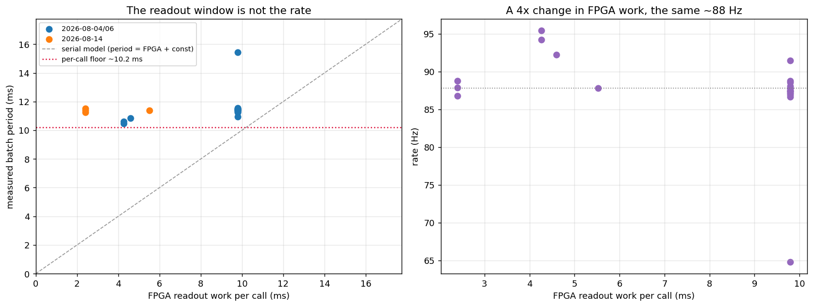
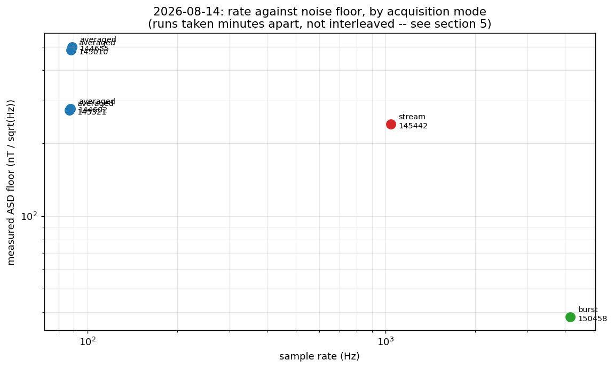
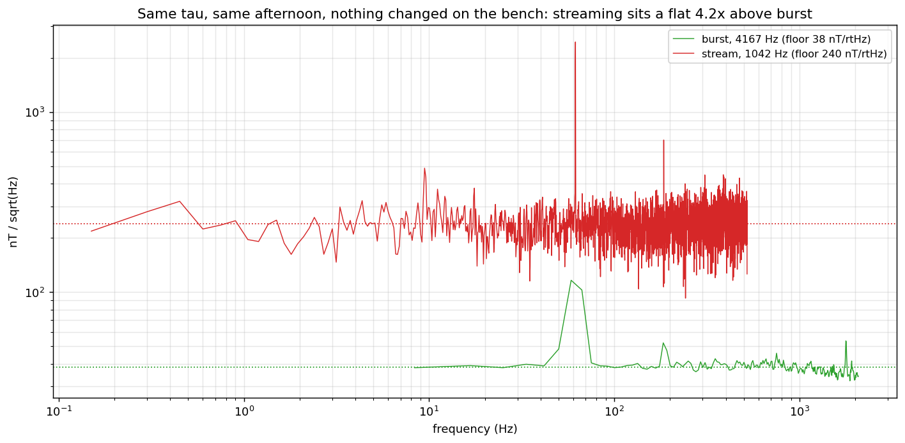

# Two-point lock-in: the three acquisition modes, and where the time goes

**Session analysed:** `data/results/081426 (Sensitivity increase update)/` (2026-08-14)
**Written:** 2026-08-17
**Regenerate every number and figure here:** `python scripts/analyze_twopoint_0814.py`
**Rig-only measurements:** `python scripts/profile_twopoint_acquire.py --floor --compare-read-paths`

Tables live in [`tables/`](tables/), figures in [`figures/`](figures/). Nothing below is
typed by hand; re-running the analysis after a new session refreshes the document rather
than invalidating it.

> **Superseded 2026-08-17 by the master reference.** This document and the 2026-08-06
> analysis are merged into [`../twopoint_master_reference/TWOPOINT_MASTER_REFERENCE.pdf`](../twopoint_master_reference/TWOPOINT_MASTER_REFERENCE.pdf) (44 pp.), which adds a per-method timing
> breakdown with every component's contribution in milliseconds, a work log of what has
> been changed and pushed, and a to-do list with pass criteria. This file is kept as the
> record of what was believed on its date.

This supersedes the timing conclusion of
[`../2026-08-06_twopoint_timing/`](../2026-08-06_twopoint_timing/TIMING_AND_NOISE_ANALYSIS.md),
which is annotated with the correction. Its readout-window analysis (§3 there) still stands.

---

## 1. What this session established

The 2026-08-14 runs were taken after the reference-photodiode gain was corrected and the
signal diode stopped saturating. They are the first session to run **all three acquisition
modes at the same readout window**, which is what makes the comparisons below possible.

**The photodiode change is real and large.** The burst-mode noise floor went from
**158 → 38 nT/√Hz**, a factor of **4.1**, at the same 2 parked points.

**The averaged mode is still ~88 Hz, and no readout-window change will alter that.** τ was
correctly reduced from 213 to 120 µs — the data confirms it — and the FPGA readout work per
call fell from 9.80 ms to 2.40 ms. The batch period did not move: 11.37 ms → 11.34 ms.
There is a **~10 ms floor per `acquire()` call** that has nothing to do with the readout
window. This reverses the diagnosis in the August document (§3.3).

**Streaming does reach 1 kHz.** 31,250 samples in 30.000 s = 1041.7 Hz, with `rep_index`
advancing by exactly 4 across 125,000 reps: **zero gaps, zero duplicate rows**. The rate
claim held. Its *noise* did not — see §5.

**Two defects remain open.** Burst mode still replays ~50% of its batches, and the fix
applied on 2026-08-12 is now disproved (§6). Streaming's noise floor is ~6× the burst
floor for reasons not yet identified (§5). Both have a designed experiment waiting on the
rig (§9).

---

## 2. The three modes

All three run the same FPGA program — `MultipointLockinODMR.body()` emits one MW pulse and
one ADC integration window per parked frequency, per rep. They differ only in **how the
host gets the data out of the accumulated buffer**, and that turns out to matter more than
anything else.

| | **4A averaged** | **4B burst** | **4C streaming** |
|---|---|---|---|
| call pattern | one `acquire()` per sample | one `acquire()` per `reps` samples | one `start_readout`, then poll |
| what a call returns | the mean over `reps` | every rep, as its own sample | packets of reps, continuously |
| measured rate | 86.8–88.8 Hz | 4167 Hz in-burst, 3083 Hz net | 1041.7 Hz |
| set by | the ~10 ms host call | the FPGA cadence | the FPGA cadence |
| duty cycle | ~21% (at τ=120, 10 reps) | 74% | ~100% |
| measured floor | 274–501 nT/√Hz | **38 nT/√Hz** | 240 nT/√Hz |
| open defects | none | ~50% of bursts replay | floor ~6× burst |

### 2.1 Averaged — `acquire()`

`analyze_results` averages over the rep axis and returns one number per parked frequency.
The rep axis is *thrown away*, which is the whole cost of this mode: those reps were
already independent time samples spaced by the FPGA cadence.

Use it when ~88 Hz is enough. It is the only mode with no open defect.

### 2.2 Burst — `acquire(per_rep=True)`

Identical program, but `analyze_results` keeps the rep axis, so one call returns `reps`
time samples spaced by `time_per_rep()`. The ~10 ms host cost is paid once per *burst*.

The catch is that each call re-arms the accumulated buffer under a program that may still
be running (§6).

### 2.3 Streaming — `stream()`

One `config_all`, one `start_readout(total_reps)`, then nothing but draining the streamer
queue with `poll_data()`. Nothing is re-armed mid-run, so the burst race cannot occur by
construction, there is no inter-burst gap, and the timestamps follow the FPGA cadence
exactly rather than being reconstructed from arrival times.

`cfg.reps` **is** the run length here: the tProc loops that many times and ends, so it must
be set before compilation and cannot change mid-run.

---

## 3. Where the acquisition time goes

### 3.1 One rep, step by step

`MultipointLockinODMR.body()`
([`notebook_modules/multipoint_lockin_program.py:191-236`](../../notebook_modules/multipoint_lockin_program.py))
emits, per parked frequency:

| # | ASM step | Cost |
|---|---|---|
| 1 | `mw_frequency_register.set_to(f)` | a few tProc cycles (~ns) |
| 2 | `pulse(ch=mw_channel, t=0)`, length = readout window | overlaps the readout, adds nothing |
| 3 | `trigger_no_off(adcs, pins=[laser_gate], width=readout_integration_treg, t=0)` | **the ADC integration window — this is the rep** |
| 4 | `trigger(pins=[laser_gate], width=relax_delay_treg, t=readout_integration_treg)` | 3.3 µs nominal, closes the laser gate |
| 5 | `wait_all()` | ~0 |
| 6 | `sync_all(relax_delay_treg)` | 3.3 µs nominal |

With `multipoint_skip_reference = True` and `"forward"` ordering that is **two ADC windows
per rep** and nothing else of consequence:

```
time_per_rep = n_slots × n_readouts_per_slot × readout_integration_tus
             = 2 × 1 × 120 µs = 240 µs        (measured: 240.0 µs, §3.2)
```

`"abba"` ordering makes it 4 slots, and keeping the reference readout makes it 2 readouts
per slot; either doubles the rep.

### 3.2 The exact FPGA time, recovered from the data

The readout time does not have to be taken on trust from the notebook's configuration. It
is recoverable from the recorded numbers, exactly.

`analyze_results` divides the accumulated buffer — an **integer** — by
`readout_integration_treg`, then averages over `reps`. Every stored count is therefore an
integer multiple of `1 / (treg × reps)`. Finding the smallest divisor `D` that makes all of
a run's counts integral recovers `D = treg × reps`, and the readout time follows:

```
FPGA readout per call = n_slots × D / f_clk        f_clk = 307.2 MHz
```

The clock is pinned by two independent runs: τ = 213 µs ↔ treg 65434 and τ = 120 µs ↔
treg 36864 both give 307.2 MHz.

Only the **product** is identifiable, not its factors — 36864 is (treg 36864 × reps 1) and
(treg 768 × reps 48) equally well. That is fine, because the readout time depends only on
the product. In burst mode, where there is no rep averaging, `D` *is* `treg` and the
readout window follows directly: the 2026-08-14 burst run reads **τ = 120.0 µs**, exactly
as configured. `twopoint_postprocess.recover_readout_quantum()` implements this.

**This is also the right way to get the burst cadence.** The wall-clock estimate
(`acq_seconds / n_samples` over the real batches) reads 269 µs against a true 240 µs,
because it includes the host share of each acquire — a 12% stretch that would go straight
into the time axis, the quoted rate and the frequency scale of every spectrum.

### 3.3 The ~10 ms per-call floor

Applying §3.2 to all 21 usable averaged runs across three sessions
([`tables/timing.csv`](tables/timing.csv)):

| session | FPGA readout | fastest call | median period | rate |
|---|---|---|---|---|
| 2026-08-04 | 4.26 ms | 9.35–9.53 ms | 10.48–10.62 ms | 94–95 Hz |
| 2026-08-04 | 4.60 ms | 9.29 ms | 10.84 ms | 92 Hz |
| 2026-08-04/06 | 9.80 ms | 9.61–10.29 ms | 10.93–11.54 ms | 87–91 Hz |
| **2026-08-14** | **2.40 ms** | **10.14–10.30 ms** | **11.26–11.52 ms** | **87–89 Hz** |
| **2026-08-14** | **5.52 ms** | **10.27 ms** | **11.39 ms** | **87.8 Hz** |



Three things follow, and they are what the section is for.

**The period does not track the FPGA work.** Fitting period against FPGA work *within* a
session — across sessions would confound it with the floor itself, which moved ~1 ms
between August 4/6 and August 14:

| session | FPGA work | period | slope |
|---|---|---|---|
| 2026-08-04/06 | 4.26 → 9.80 ms (2.3×) | 10.55 → 11.43 ms | **+0.14** |
| 2026-08-14 | 2.40 → 5.52 ms (2.3×) | 11.38 → 11.39 ms | **+0.003** |

A serial model `period = host + FPGA` requires a slope of 1.0.

**No serial model can fit at all.** The 2026-08-14 runs used 2.40 ms of FPGA work, and
their *fastest* call was still 10.14 ms. A serial model would need a host term of 7.7 ms
there against 1.6 ms in the August analysis — for the same code on the same rig, days
apart. The two terms are not additive; the FPGA runs underneath the host round-trip.

**The correct model is therefore:**

```
period ≈ max(host_call, reps × time_per_rep)
```

with `host_call ≈ 11.4 ms` typical and a floor around 10.1 ms on this rig. Predicted
against measured:

| τ | reps | FPGA | predicted | measured |
|---|---|---|---|---|
| 213 µs | 23 | 9.80 ms | 87.7 Hz | 87.5 Hz |
| 120 µs | 23 | 5.52 ms | 87.7 Hz | 87.8 Hz |
| 120 µs | 10 | 2.40 ms | 87.7 Hz | 86.8 Hz |

The model giving the *same* answer for all three is the point. The old model predicted 160,
400 and 180 Hz for these.

`MultipointLockinODMR.measure_host_floor()` calibrates the constant on the rig in about a
second, and should be run at the start of a session rather than trusting the default — the
floor already differs by 1.2 ms between the two sessions here.

### 3.4 The consequence nobody had exploited: averaging is free

If the FPGA work hides under the call, then **running fewer reps than fit is pure loss**.
The call takes the same wall-clock time either way, so the unused milliseconds are photons
that were not collected.

At τ = 120 µs the per-call floor holds **42 reps**. The 2026-08-14 runs used **10**. That is
a factor of ~2 in σ available at *identical* rate, for free.

Step 4A now does this automatically (`AVG_REPS_PER_BATCH = None` →
`prog.reps_that_fit(measured_floor)`), and `describe_timing()` prints the headroom:

```
2 freqs, order=forward (2 slots/rep), tau=120.0 us, 10 reps -> 240 us/rep, 2.40 ms FPGA work
  averaged mode: 2.40 ms of FPGA work hides under the 10.1 ms per-call floor (24% used) -> 87.7 Hz
  FREE AVERAGING: 42 reps also fit inside the floor. Raising 10 -> 42 costs no rate and
                  buys up to 2.0x in sigma if the noise is white.
```

The caveat is in that last clause, and §7 shows it does not currently hold: the averaged
mode's noise does **not** average down. Filling the budget is still free, so it is worth
doing — but expect less than √4.2 until the per-acquire term in §7 is understood.

### 3.5 What each knob actually buys

| knob | effect on rate | effect on sensitivity | verdict |
|---|---|---|---|
| `readout_integration_tus` (τ) | **none** below the floor; linear above | flat for τ ≤ 140 µs, worse above (Aug §3) | **not a rate lever** in averaged mode; it *is* the cadence in burst/stream |
| `reps` | **none** below the floor; linear above | should be 1/√N; measured much less (§7) | free averaging up to the floor |
| `multipoint_skip_reference` | 2× (already on) | removes a contaminated normaliser | keep on |
| `multipoint_pair_order` | 2× per rep for `"abba"` | cancels linear common-mode drift; free at equal averaging | untested on the rig |
| `n_freqs` | linear | 2 is the minimum for a two-point estimator | fixed at 2 |
| mode (4A/4B/4C) | **12–47×** | see §4 | **the only real rate lever** |
| the host call itself | sets the 88 Hz ceiling | none | avoidable only by not calling per sample |

---

## 4. What each mode delivered

From [`tables/modes.csv`](tables/modes.csv). `η = σ_B·√(2Δt)` is the white-noise
sensitivity implied by the measured standard deviation; **floor** is the median amplitude
spectral density in the flat part of the spectrum. When they disagree the trace is not
white and the floor is the number to trust.

| session | mode | run | rate | σ(Δf) | η | floor |
|---|---|---|---|---|---|---|
| 08-14 | averaged | 144602 | 87.8 Hz | 56.4 kHz | 304 | 278 nT/√Hz |
| 08-14 | averaged | 144655 | 88.8 Hz | 98.1 kHz | 526 | 501 |
| 08-14 | averaged | 145010 | 87.9 Hz | 92.1 kHz | 496 | 486 |
| 08-14 | averaged | 145321 | 86.8 Hz | 54.6 kHz | 296 | 274 |
| 08-14 | **stream** | 145442 | **1041.7 Hz** | 160.8 kHz | 251 | 240 |
| 08-14 | **burst** | 150458 | 4166.7 Hz (3083 net) | 71.4 kHz | 56 | **38** |
| 08-06 | averaged | 144936 | 86.7 Hz | 95.0 kHz | 515 | 499 |
| 08-06 | burst | 145051 | 2347 Hz (2108 net) | 256.1 kHz | 267 | 158 |



**The photodiode change delivered 4.1×** in the mode that can show it: burst floor
158 → 38 nT/√Hz between the two sessions.

**Burst is far and away the best operating point today** — 38 nT/√Hz at an effective
3.1 kHz, against 240 for streaming and 274–501 for averaged.

**But these runs are not strictly comparable.** They were taken minutes apart, not
interleaved, and §7 shows the per-rep noise varied by a factor of 3.6 between two averaged
runs three minutes apart. Any A/B across runs on this rig is unreliable; only interleaved
measurements settle anything. That is why §9's first test interleaves.

---

## 5. The streaming noise excess

Streaming and burst ran ten minutes apart at the same τ, with nothing changed on the bench.
Their amplitude spectral densities differ by a **flat factor of ~6 across the whole band**
([`tables/read_path.csv`](tables/read_path.csv)):

| band | stream | burst (cleaned) | ratio |
|---|---|---|---|
| 10–30 Hz | 235 nT/√Hz | 38.6 | 6.08 |
| 30–60 Hz | 234 | 44.1 | 5.31 |
| 60–100 Hz | 241 | 39.8 | 6.06 |
| 100–200 Hz | 231 | 38.7 | 5.97 |
| 200–350 Hz | 242 | 38.8 | 6.25 |
| 350–500 Hz | 250 | 39.7 | 6.30 |



### 5.1 What it is not

| candidate | measurement | verdict |
|---|---|---|
| mains pickup | 60 Hz comb is 4.5% of the stream's shift variance | ruled out |
| the PL droop / slow drift | below ~10 Hz is 2.8% of the shift variance | ruled out |
| dropped or duplicated reps | 0 `rep_index` gaps, 0 duplicate rows in 31,250 samples | ruled out |
| packet-boundary artefacts | σ at the first 5 rows of a packet is 0.96× the mid-packet σ | ruled out |
| buffer overflow as packets fill | the 500-sample first packet is no noisier than the 205-sample ones | ruled out |
| torn reads (partial accumulations) | residual is symmetric, skew +0.12 — torn reads would skew low | ruled out |

A flat, structureless, frequency-independent factor is what a **read-path** difference
looks like, not a physical disturbance. The two paths pull from the same accumulated buffer
but differ in how they configure and drain it.

### 5.2 What has been done about it

`stream()`'s configuration sequence now mirrors `NVAveragerProgram.acquire()` step for
step. It did not before: `qd.soc.reload_mem()` was missing entirely, and `config_bufs` ran
in a different order relative to `start_src`. That is the cheapest candidate to eliminate
and it costs nothing if it turns out to be irrelevant.

`stream()` also now refuses to reshape a packet whose payload does not match its own rep
count. Silently reshaping such a packet would misalign every subsequent sample and mix the
two parked frequencies together — which would produce exactly this kind of flat excess. No
occurrence has been observed, but it would previously have been invisible.

### 5.3 What has not

**Whether either change fixes it.** That needs the rig, and §9's first test is designed to
answer it in about a minute.

### 5.4 The PL droop

A separate, smaller streaming issue. With no gap between acquires the sample heats: PL fell
**25%** over the 30 s run (993 → 744 ADC), smoothly. It is mostly common-mode and largely
cancels in `z+ − z−` — it is only 2.8% of the shift variance — but it walks the operating
point off the calibrated flank, so the slopes the conversion uses drift out of validity.
Step 5C detrends it and reports the magnitude; a periodic re-zero would be the real fix.

---

## 6. Burst mode: the replay, and a disproved fix

Every burst run in both sessions shows the same signature: acquires strictly alternate
short and long, and the short ones return a bit-identical copy of the previous batch.

| run | batches | stale | fraction | pattern |
|---|---|---|---|---|
| 2026-08-06 145051 | 44 | 23 | 52.3% | ~13 / ~425 ms |
| 2026-08-06 142358 | 211 | 106 | 50.2% | ~13 / ~425 ms |
| **2026-08-14 150458** | **371** | **185** | **49.9%** | **~12 / ~120 ms** |

### 6.1 The August root cause is disproved

The 2026-08-06 analysis identified a real bug: `qickdawg` called `config_all` with
`load_pulses=`, which `qick` 0.2.386 does not accept, so every acquire raised `TypeError`,
fell back to `config_all(soc)` with `reset=False`, and `stop_tproc(lazy=True)` is a
documented no-op on tProc v1 — the tProc was never stopped between runs.

That was fixed on 2026-08-12 and `reset_tproc=True` was wired through. **The 2026-08-14 run
used it and the replay fraction was unchanged at 49.9%.** The rig was definitely running
the new code: τ = 120 µs took effect and the new streaming cell produced output.

So the keyword bug was real and worth fixing, but it was **not the mechanism**. The root
cause is unknown.

### 6.2 What is done about it

`cfg.multipoint_on_stale = "drop"` makes the freshness guard re-acquire
(`multipoint_stale_retries`, default 2) and, if every attempt still returns the same
buffer, return `None` so the caller **skips the batch**. A replay is no longer written to
the CSV as though it were data.

This costs duty cycle, not correctness. The recorded rate becomes honest: 3083 Hz rather
than the 6161 Hz the raw file claims.

Two smaller burst issues, both handled:

* **Row 0 of every real batch reads ~1.4% high** (1210.6 against 1193.4 ADC) — a genuine
  post-idle transient, distinct from the replay. Dropped at acquisition and again in
  post-processing.
* **The time axis was wrong by construction.** The old cell stamped each burst across its
  *measured* wall-clock window, so a 12 ms stale batch and a 120 ms real batch both got
  500 timestamps — a ~10× alternating compression, which is the striping visible in the
  plots. Timestamps now come from the cadence.

### 6.3 Recovering runs already recorded

```
python scripts/clean_burst_lockin.py <live_csv> --outdir analysis/
```

Drops replayed batches and row-0 transients, retimes on the exact cadence, marks the dead
time between bursts as real gaps so no filter or spectrum crosses one, and despikes the
differential. On the three 2026-08-06 files it recovers 50–52% of batches as replays and a
flat per-segment spectrum.

---

## 7. The noise is not photon shot noise

Per-rep normalised-PL noise, scaled back from whatever averaging each run used
([`tables/per_rep_noise.csv`](tables/per_rep_noise.csv)):

| session | mode | reps averaged | per-rep σ(z) | relative |
|---|---|---|---|---|
| 08-06 | burst | 1 | 0.0076 | 0.67% |
| 08-06 | burst | 1 | 0.0091 | 0.83% |
| 08-06 | averaged | 23 | 0.0114 | 1.11% |
| 08-06 | averaged | 23 | 0.0161 | 1.38% |
| **08-14** | **burst** | **1** | **0.0059** | **0.61%** |
| 08-14 | stream | 4 | 0.0522 | 7.57% |
| 08-14 | averaged | 10 | 0.0214 | 2.45% |
| 08-14 | averaged | 10 | 0.0513 | 5.97% |
| 08-14 | averaged | 23 | 0.0755 | 8.95% |

Two things stand out.

**Burst is reproducibly 0.61–0.83% in both sessions; everything else is 1.1–9%.** Burst
measures the per-rep noise *directly*; the other rows infer it by scaling up. The gap means
the inference is wrong — i.e. the noise in those modes is not a per-rep term.

**Averaged mode gets *worse* with more reps** (10 reps → 2.45%, 23 reps → 8.95%). Shot
noise cannot do that. The dominant term is **per-acquire**, not per-rep, so it survives
averaging entirely.

This is why §3.4's free averaging comes with a caveat, and it is the most valuable open
question in the session: if the per-acquire term were removed, the averaged mode would
inherit the burst mode's 4× better noise at no cost in rate.

It also means **run-to-run comparisons on this rig are unreliable**. Two averaged runs
three minutes apart (145010 and 145321) differ by 2.4× in per-rep noise with identical
settings. Only interleaved measurements can compare anything.

---

## 8. Mains, and what 88 Hz does to it

From [`tables/spectra.csv`](tables/spectra.csv):

| mode | rate | strongest line | excess over floor | 60 Hz appears at |
|---|---|---|---|---|
| averaged | 86.8–88.8 Hz | — | — | **26.8–28.8 Hz (aliased)** |
| stream | 1041.7 Hz | 61.7 Hz | 10.2× | 60 Hz |
| burst | 4166.7 Hz | 58.5 Hz | 3.0× | 60 Hz |

The mains line is real and strong — 10× the noise floor in the streamed data, with odd
harmonics at 185, 308 and 465 Hz.

**At 88 Hz it folds to ~27 Hz**, into the middle of the measurement band, where it is
indistinguishable from signal and cannot be filtered out. A notch there would remove real
signal along with it. This is a structural argument for running at ≥ 1 kHz for drone and
MCG work, independent of sensitivity: only there can the pickup be seen for what it is and
removed. `twopoint_spectra.alias_report()` raises this automatically and Step 5A prints it.

---

## 9. Verifying on the rig

Three tests, each deciding one open question. Run them in this order.

**S1 — burst vs stream, interleaved (about 1 minute).** The decisive one.

```
python scripts/profile_twopoint_acquire.py --compare-read-paths --tau 120 --reps 500
```

Alternates `acquire(per_rep=True)` and `stream()` on the **same program object**, five
times, within seconds. Identical FPGA work; only the read path differs.

* ratio ≈ 1.0 → the ~6× was the environment, and streaming needs no caveat
* ratio ≫ 1 → streaming really is noisier on identical work, and it is a software defect

**S2 — does the streaming excess grow with run length?**

```
python scripts/profile_twopoint_acquire.py --stream-scan
```

Streams at 2k / 20k / 125k reps. A floor that grows with length means the board worker is
losing the race as the accumulated buffer fills; a flat one means the excess is per-sample.

**S3 — confirm the floor.**

```
python scripts/profile_twopoint_acquire.py --floor --tau 120 --reps 1 4 10 23 42 100
```

Expect a fastest call of 9–11.5 ms with a reps=1 probe, and the period flat against reps
until the FPGA work outgrows it.

**S4 — free averaging.** A 30 s Step 4A run with `AVG_REPS_PER_BATCH = None`. Pass: still
~88 Hz, and σ(Δf) no worse than the 54.6 kHz of run 145321. Given §7, do not expect the
full 2× improvement.

**S5 — the honest burst rate.** A 30 s Step 4B run with `BURST_ON_STALE = "drop"`. Pass:
`BURST_STALE_FRACTION` is reported, and the CSV contains no replayed batches — check that
Step 5B's `n_stale_batches` reads 0 on the file Step 4B just wrote.

**S6 — the per-acquire noise term (§7).** The most valuable and the least specified. Within
one sitting, alternate averaged runs at reps = 10, 23 and 42 and check whether σ falls as
1/√reps. If it does not, the term is per-call, and the next question is whether it tracks
the idle time between calls.

---

## 10. Changelog

### `notebook_modules/multipoint_lockin_program.py`

* `HOST_OVERHEAD_S = 1.6 ms` → `HOST_CALL_S = 11.4 ms` and `HOST_FLOOR_S = 10.1 ms`, with
  `period = max(host_call, reps × time_per_rep)`.
* `reps_that_fit()` and `measure_host_floor()` — free-averaging planner and per-session
  calibration.
* `describe_timing()` reports the headroom rather than a single predicted rate.
* `multipoint_on_stale = "drop"` and `multipoint_stale_retries`; `acquire()` returns `None`
  for a batch that stays stale.
* `stream()` configuration sequence aligned with `acquire()`'s (added `reload_mem()`);
  refuses to reshape a mismatched packet; `stream_qc()` counters.

### New modules

* `notebook_modules/twopoint_spectra.py` — every FFT, with the conventions fixed once:
  one-sided PSD, `η = σ_B·√(2Δt)`, 28.024 kHz/µT. Includes `alias_report()` and a comb
  notch. Verified against Parseval and a synthetic tone.
* `notebook_modules/twopoint_postprocess.py` — one pipeline per mode, dispatched on
  columns. `recover_readout_quantum()` / `readout_seconds()` implement §3.2.
* `notebook_modules/twopoint_runner.py` — the mechanical pieces the acquisition cells
  share: append-only CSV writer, row building, timing/freshness/calibration reports.

### Fixes found while validating

* **Despiking the parked channels independently raises σ.** They are 0.84–0.97 correlated
  through the common-mode PL, and the filter flagged 30 and 23 samples with only 4 in
  common; each one-sided replacement injects differential noise. Measured: 54.6 → 55.8 kHz
  (averaged), 160.8 → 175.5 (stream). The default is now `despike_shift()` on the
  differential: 54.6 → 53.6 and 160.8 → 155.2.
* **The burst cadence was 12% wrong** — taken from wall-clock, which includes the host
  share. Now from the readout quantum (§3.2).

### `Modules/Twopoint_Lockin_module.ipynb`

Split into Step 4A/5A (averaged), 4B/5B (burst), 4C/5C (streaming) and Step 6 (post-process
any saved run). Acquisition parameters stay inline; each analysis cell is ~15 lines over
the modules.

### `scripts/`

* `analyze_twopoint_0814.py` — new, regenerates everything here.
* `profile_twopoint_acquire.py` — added `--compare-read-paths`, `--stream-scan`, `--floor`.
* `clean_burst_lockin.py` — delegates to `twopoint_postprocess`.

---

## 11. Reproducing this

```bash
# Everything in this document, from committed CSVs, no hardware:
python scripts/analyze_twopoint_0814.py

# Clean one recorded run (any mode, detected from the columns):
python -m twopoint_postprocess "data/results/081426 (Sensitivity increase update)/two-point lockin/twopoint_lockin_live_20260814_150458.csv"

# Burst-specific CLI with the original flags:
python scripts/clean_burst_lockin.py <live_csv> --outdir analysis/

# Static check of the config_all signature (no hardware):
python scripts/profile_twopoint_acquire.py --check-only

# Rig only:
python scripts/profile_twopoint_acquire.py --floor --compare-read-paths --stream-scan
```
